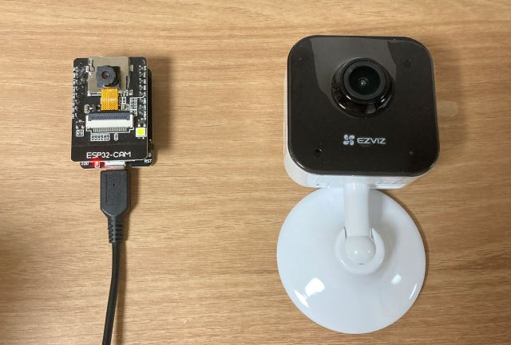

# AI Door System

**목차**
- [개요](#개요)
- [주요 기능](#주요-기능)
- [기술 스택](#기술-스택)
- [구성](#구성)
- [실행](#실행)


※ 생성형 AI를 활용하여 작성되었습니다.


## 개요

**스마트 현관 방문자 감지 및 알림 시스템**

아두이노 웹캠(예정)을 활용하여 현관 앞을 24시간 모니터링하는 스마트 보안 시스템을 구축합니다. YOLO 모델을 통해 사람, 택배 등 다양한 객체를 실시간으로 감지하고, 감지 시점의 연속 이미지를 캡쳐해 텔레그램을 통해 즉시 알림을 전송합니다. 모든 이벤트는 웹 대시보드에서 확인할 수 있는 통합 관리 시스템을 제공합니다.




**주요 흐름**
1. 현관문 앞에 카메라 설치
2. 실시간 영상을 스트리밍으로 서버로 전송
3. 서버에서 영상을 YOLO 모델로 객체 감지 및 분류
4. 감지된 객체 정보를 데이터베이스에 저장
5. 객체 탐지 상황을 사용자에게 알림
6. 웹 대시보드를 통해 이벤트 히스토리 관리
7. 미분류로 분류된 사진은 나중에 학습을 위한 자동화 처리


## 주요 기능

**핵심 기능**
- 실시간 영상 수신 및 처리
- YOLO을 활용한 객체 감지 (사람, 패키지, 배달음식, 우편물, 미분류)
- 객체가 감지되면 2초 간격으로 5장 이미지 연속 캡처
- 텔레그램으로 사용자에게 알림
- 이벤트 로그 저장 및 관리

**알림 및 모니터링**
- 이벤트 히스토리 관리
- 캡처된 이미지들을 시간순 정렬하여 표시
- 알림 on/off, 감지 민감도 조절 등 설정
- 카메라 상태, 서버 성능 등 시스템 모니터링

**최적화**
- GPU 가속 처리
- 이미지 압축 및 품질 조절
- 스토리지 용량 관리 (자동 삭제 정책)
- CPU/GPU 사용률 모니터링

**추가 기능**
- 서버로 최적화된 모델 전송
- 미분류 객체 경우 학습용 데이터로 자동 수집
- 대시보드를 통해 카메라 재시작, 설정 변경 등 원격 제어
- 객체가 움직이는 경우 추적 및 기록 (SORT/DeepSORT)
- 동작 패턴 학습 : 자주 오는 방문자 인식, 비정상 행동 감지 등


## 기술 스택

**하드웨어**
- ESP32-CAM or HOME CAM

**백엔드**
- Python 3.11
- FastAPI
- Telegram Bot API
- SQLAlchemy

**프론트엔드**
- 예정

**데이터베이스**
- MySQL

**스토리지**
- MinIO

**AI/ML**
- YOLOv11
- OpenCV
- PyTorch


## 구성

**시스템 아키텍처**
```
┌────────────────┐    ┌─────────────────┐     ┌─────────────────┐    ┌──────────────────┐
│   1. Camera    │    │   2. Server     │     │  3. Dashboard   │    │  4. ML Training  │
│   (Hardware)   │    │    (Backend)    │     │    (Frontend)   │    │   (ML Pipeline)  │
├────────────────┤    ├─────────────────┤     ├─────────────────┤    ├──────────────────┤
│ • ESP32-CAM    │ -> │ • Stream API    │ <-> │ • React/Vue.js  │    │ • Data Pipeline  │
│ • HOME CAM     │    │ • YOLO Engine   │     │ • Real-time UI  │    │ • Model Training │
└────────────────┘    │ • Detection API │     │ • Event Monitor │    │ • Validation     │
                      │ • Dashboard API │     │ • Settings UI   │    │ • Model Export   │
                      │ • Notification  │     └─────────────────┘    └──────────────────┘
                      │ • Database      │
                      │ • MinIO Client  │
                      └─────────────────┘

                      ┌─────────────────┐              
                      │   5. MinIO      │ 
                      │  (S3 Storage)   │
                      ├─────────────────┤
                      │ • images/       │  
                      │ • models/       │  
                      │ • datasets/     │ 
                      └─────────────────┘
```


**주요 흐름**
```
객체 감지
[카메라] → [서버] → [객체 감지] → [데이터베이스 저장, 텔레그램 알림, 이미지 저장 (MinIO)]

모델 학습
[모델 학습] → [모델 저장소 저장 (MinIO), 데이터베이스 저장] ← [서버]

모델 개선
[미분류 이미지 (MinIO)] → [모델 재학습] → [모델 배포 (MinIO)]
```

- camera : 현관문 앞 실시간 영상 스트리밍
- server : 영상 수신, 객체 탐지, 이미지 저장, 알림 전송
- dashboard : 이벤트 관리 웹 인터페이스
- train : 모델 학습, 모델 평가, 모델 배포
- minio : 모델 저장, 데이터셋 저장, 이미지 저장


**구조**
```bash
door-camera-system/
├── docker-compose.yml
├── nginx.conf
├── README.md
├── camera/                 # 1. 카메라 (Hardware)
│   ├── esp32-cam/
│   └── README.md
├── server/                 # 2. 서버 (Backend)
├── dashboard/              # 3. 대시보드 (Frontend)
├── ml-training/            # 4. 모델 학습
└── minio/                  # 5. MinIO (Storage)
    ├── images/              
    ├── models/              
    ├── datasets/              
    └── config/
```


**포트 (테스트)**
서비스 | 포트
---|---
대시보드 | 3000
서버 | 8000
모델 | 8090
스토리지 | 9000 (API), 9001


## 실행 가이드

**사전 설치**
- Git
- Docker & Docker Compose
- Python 3.11


**실행**
```bash
git clone https://github.com/<username>/project-yolo
cd project-yolo

# 환경 변수 설정
cp .env.example .env

# 실행
docker-compose up -d
```
