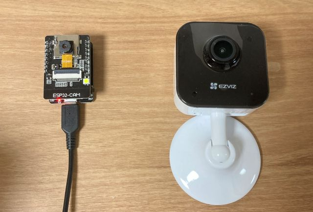

# Camera Module

현관 모니터링 카메라 모듈


**카메라 타입**
- Arduino
- HOME CAM




## Arduino

ESP32-CAM과 MB 업로드 보드를 사용하여 현관 앞을 실시간 모니터링하는 카메라 시스템입니다.


**구성**
- ESP32-CAM
- CH340 micro USB 업로드 보드 (MB 보드)
- Micro USB 케이블 (Type-A to Micro-B)


**설치**
- Arduino IDE
- CH340 드라이버


### Arduino IDE

**1. 환경 설정**
```
파일 > 환경설정 > 추가 보드 관리자 URLs 필드에 입력
https://raw.githubusercontent.com/espressif/arduino-esp32/gh-pages/package_esp32_index.json
```


**2. 보드 설치**
```
툴 > 보드 > 보드 매니저 > 'ESP32' 검색 > 'esp32 by Espressif Systems' 설치
```


**3. 보드 선택 및 설정**
```
툴 > 보드 > ESP32 Arduino > ESP32 Wrover Module
툴 > 포트 > (연결된 COM 포트 선택)

설정값:
- Upload Speed: 115200
- Flash Frequency: 40MHz
- Flash Mode: QIO
- Partition Scheme: Huge APP (3MB No OTA)
```


**4. 라이브러리 설치**
```
툴 > 라이브러리 관리자 > 검색 및 설치:
- WebSockets by Markus Sattler
```


**설치 테스트**
```cpp
void setup() {
  Serial.begin(115200);
  Serial.println("ESP32-CAM Test");
}

void loop() {
  Serial.println("Hello ESP32-CAM!");
  delay(1000);
}
```

1. 위 코드를 Arduino IDE에 복사
2. MB 보드의 IO0 버튼을 누른 상태에서 RST 버튼을 눌렀다 떼기
3. IO0 버튼 떼기 (부팅 모드 진입)
4. Arduino IDE에서 업로드 (Ctrl+U)
5. 업로드 완료 후 RST 버튼 눌러 재시작
6. 시리얼 모니터로 출력 확인 (Ctrl+Shift+M)


### 최적화

**프레임 레이트 조절**
```cpp
// esp32-cam.ino
const unsigned long frameInterval = 100;  // 100ms = 10 FPS

// 값이 클수록 느린 전송, 낮은 대역폭 사용
- 고화질: 200ms (5 FPS)
- 일반: 100ms (10 FPS)  
- 부드러움: 67ms (15 FPS)
```


**화질 설정**
```cpp
// camera_functions.ino
config.frame_size = FRAMESIZE_VGA;    // 640x480 (권장)
config.jpeg_quality = 12;             // 10-63 (낮을수록 고화질)

// 해상도 옵션:
- FRAMESIZE_QVGA (320x240) - 빠름, 낮은 화질
- FRAMESIZE_VGA (640x480) - 균형 (권장)
- FRAMESIZE_SVGA (800x600) - 느림, 고화질
```


### 네트워크 분리

ESP32-CAM을 별도 네트워크에서 운영하여 보안 강화

[TODO] 검토

```bash
# create_ap 설치
sudo apt install hostapd dnsmasq
git clone https://github.com/oblique/create_ap
cd create_ap
sudo make install

# 핫스팟 생성 (인터넷 공유)
create_ap -m nat wlan0 eth0 ESP32-Camera your_password

# 핫스팟 생성 (인터넷 분리)
create_ap --no-internet wlan0 ESP32-Camera your_password
```
