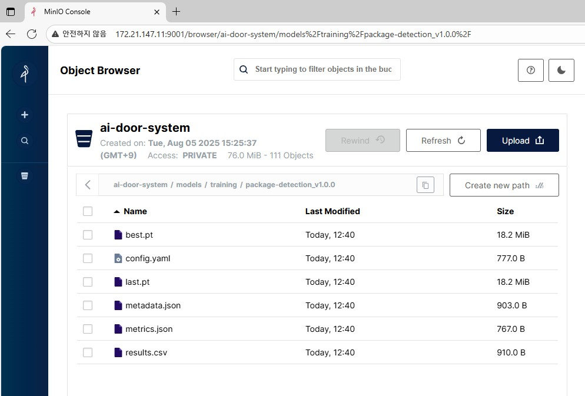

# MinIO
이미지, 데이터셋, 모델을 관리하는 중앙 저장소  


**개요**  
스마트 현관 방문자 감지 시스템의 핵심 데이터 저장소로 실시간 캡처 이미지부터 AI 모델까지 모든 데이터를 중앙 집중식으로 관리합니다.





## 구조

```bash
ai-door-system/
├── images/                      # 실시간 캡처된 이미지
│   ├── raw/                     # 원본 이미지 (날짜별)
│   │   ├── 2025-08-08/
│   │   └── 2025-08-09/
│   └── processed/               # 분류된 이미지
│       └── unclassified/        # 미분류 (추후 학습용)
├── datasets/                    # ML 학습용 데이터셋
│   ├── roboflow                 # 외부 데이터셋
│   │   ├── example/
│   ├── v1/                      # 통합 데이터셋
│   │   ├── data.yaml 
│   │   ├── train/
│   │   ├── valid/
│   │   └── test/
│   └── current -> ../v1/
├── models/                      # 모델 저장소
│   ├── training/          
│   │   ├── v1.0.0/
│   │   │   ├── best.pt          # 학습된 모델 파일
│   │   │   ├── last.pt          # 학습된 모델 파일
│   │   │   ├── config.yaml      # 모델 설정 파일
│   │   │   ├── metadata.json    # 모델 메타데이터
│   │   │   ├── metrics.json     # 성능 지표
│   │   │   └── results.csv
│   ├── production/              # 프로덕션 모델
│   │   └── current -> ../training/v1/
└── annotations/                 # 라벨링 파일
    ├── labeled/                 # 라벨링 완료된 데이터
    └── pending/                 # 라벨링 대기 중인 데이터
```


## 정책

**데이터 정책**
- 원본 이미지: 30일 보관 후 삭제
- 분류된 이미지: 30일 보관 후 압축 저장
- 실험 모델: 성능 기준으로 선별 보관
- 프로덕션 모델: 영구 보관 (백업)


**접근 권한**
- images/: 읽기/쓰기 (시스템 서비스)
- datasets/: 읽기 (학습 서비스), 쓰기 (데이터 관리자)
- models/: 읽기 (추론 서비스), 쓰기 (학습 서비스)
- annotations/: 읽기/쓰기 (라벨링 도구)


**용량 관리**
- 전체 저장소 용량: 100GB 제한
- 용량 80% 도달시 오래된 파일부터 자동 삭제
- 중요한 모델은 삭제 제외


**오류 대응**
- 파일 업로드 실패시 3회 재시도
- 모델 파일 손상시 이전 버전으로 자동 복구
- 시스템 오류시 관리자에게 알림


## 구성
### MinIO Server

**테스트**
```bash
docker run -d \
  --name minio \
  -p 9000:9000 \
  -p 9001:9001 \
  -e "MINIO_ROOT_USER=admin" \
  -e "MINIO_ROOT_PASSWORD=password123" \
  -v /data:/data \
  minio/minio server /data --console-address ":9001"


# 헬스체크
curl -I http://localhost:9000/minio/health/live
curl -I http://localhost:9000/minio/health/ready
```


**개발**
```yaml
# env
environment:
  MINIO_ROOT_USER: id
  MINIO_ROOT_PASSWORD: password
  MINIO_BROWSER: "on"
  MINIO_SERVER_ACCESS_KEY: your-access-key
  MINIO_SERVER_SECRET_KEY: your-secret-key

# docker-compose.yml
version: '3.8'

services:
  minio:
    image: minio/minio:latest
    restart: unless-stopped
    volumes:
      - /opt/minio/data:/data
      - /opt/minio/config:/root/.minio
    environment:
      MINIO_ROOT_USER: ${MINIO_ROOT_USER}
      MINIO_ROOT_PASSWORD: ${MINIO_ROOT_PASSWORD}
    networks:
      - minio-network
    
networks:
  minio-network:
    driver: bridge
```


### MinIO Client

**mc.exe**
```powershell
# MinIO Client 설치
Invoke-WebRequest -Uri "https://dl.min.io/client/mc/release/windows-amd64/mc.exe" -OutFile "mc.exe"

# 설치 확인
.\mc.exe --version

# 서버 등록
.\mc.exe alias set local http://localhost:9000 admin password123

# 버킷 생성
.\mc.exe mb local/ai-door-system

## 폴더 생성
echo "folder placeholder" > temp.txt
.\mc.exe cp temp.txt local/ai-door-system/images/raw/.keep
.\mc.exe cp temp.txt local/ai-door-system/datasets/roboflow/.keep
.\mc.exe cp temp.txt local/ai-door-system/datasets/v1/.keep
.\mc.exe cp temp.txt local/ai-door-system/models/.keep
.\mc.exe cp temp.txt local/ai-door-system/annotations/labeled/.keep
.\mc.exe cp temp.txt local/ai-door-system/annotations/pending/.keep
del temp.txt

## 폴더 구조 확인
.\mc.exe ls local/ai-door-system --recursive


# 전체 버킷 용량
.\mc.exe du local/ai-door-system

# 라이프사이클 정책 확인
.\mc.exe lifecycle list local/ai-door-system

# 접근 권한 확인
.\mc.exe anonymous list local/ai-door-system
```


[TODO] 접근 제어 추가
```bash
# 읽기 전용 정책 생성
mc admin policy add local readonly policy-readonly.json

# 사용자 생성 및 정책 할당
mc admin user add local viewer viewerpassword
mc admin policy set local readonly user=viewer
```


**파이썬**
```python
from minio import Minio

# 클라이언트 초기화
client = Minio(
    "localhost:9000",
    access_key="admin",
    secret_key="password123",
    secure=False
)

# 이미지 업로드
client.fput_object(
    "ai-door-system",
    "images/raw/2025-08-08/capture_001.jpg",
    "/path/to/local/image.jpg"
)

# 모델 다운로드
client.fget_object(
    "ai-door-system",
    "models/production/current/best.pt",
    "/path/to/local/model.pt"
)
```